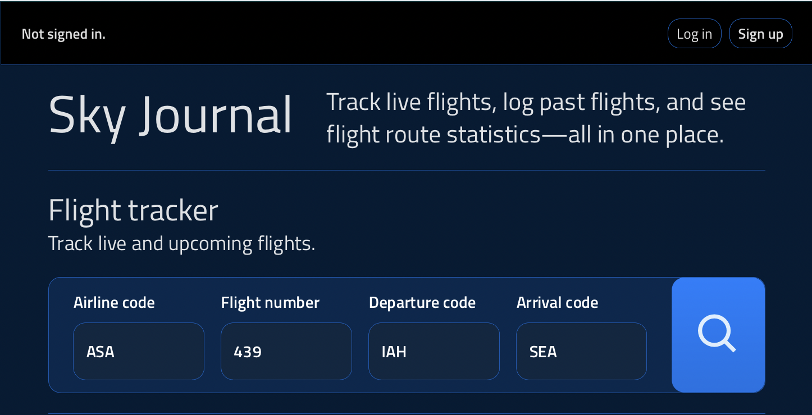
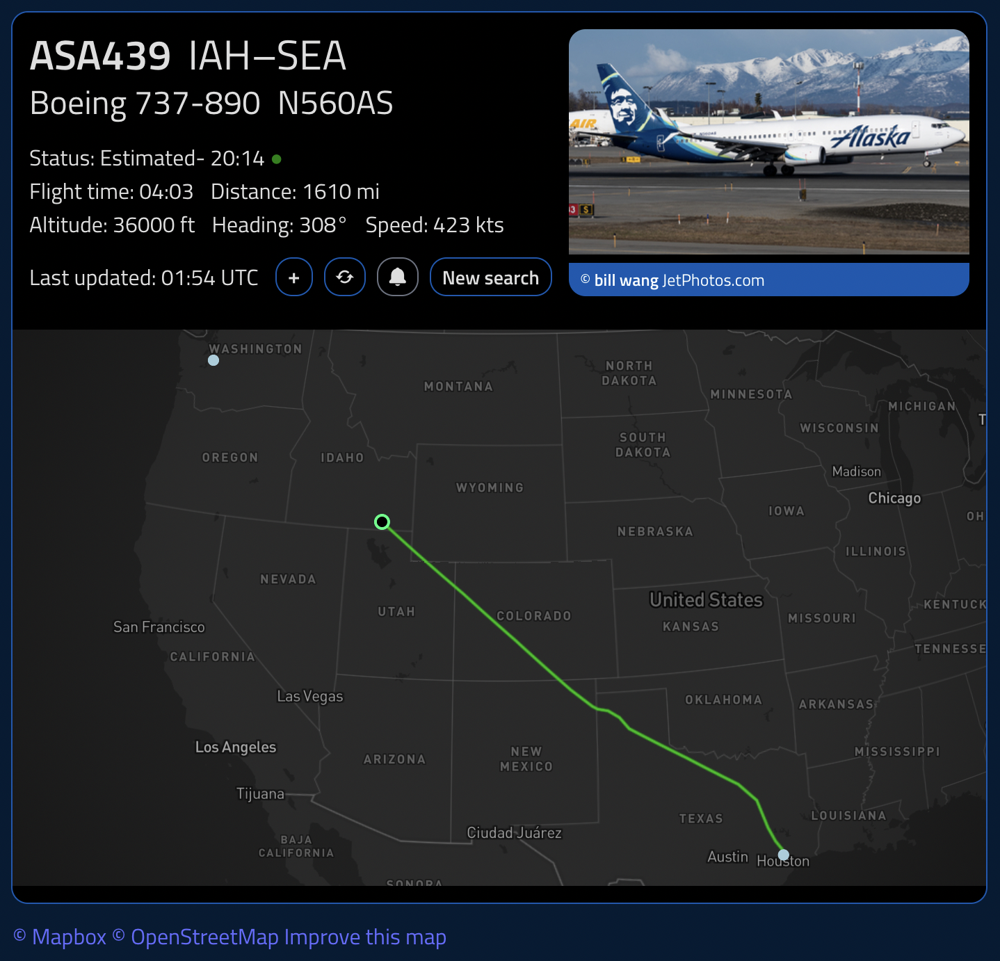
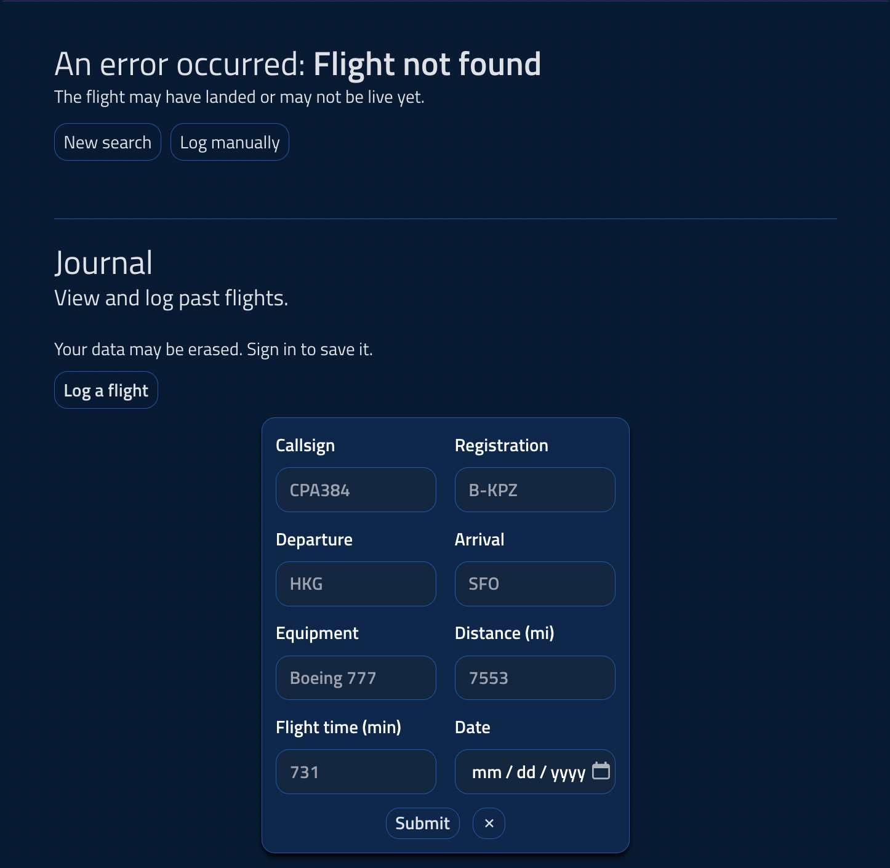
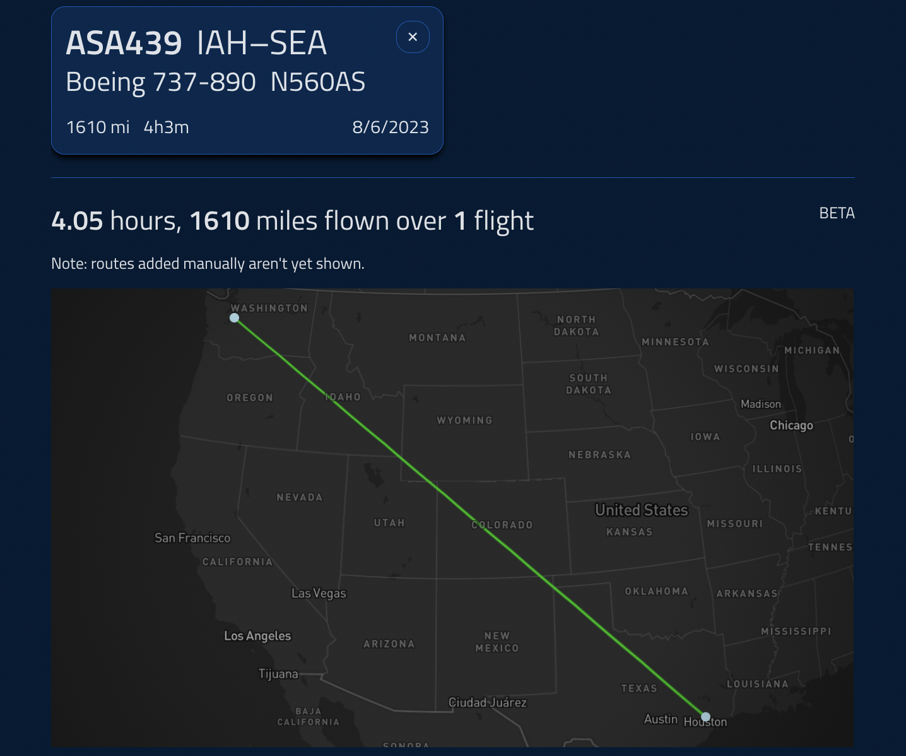
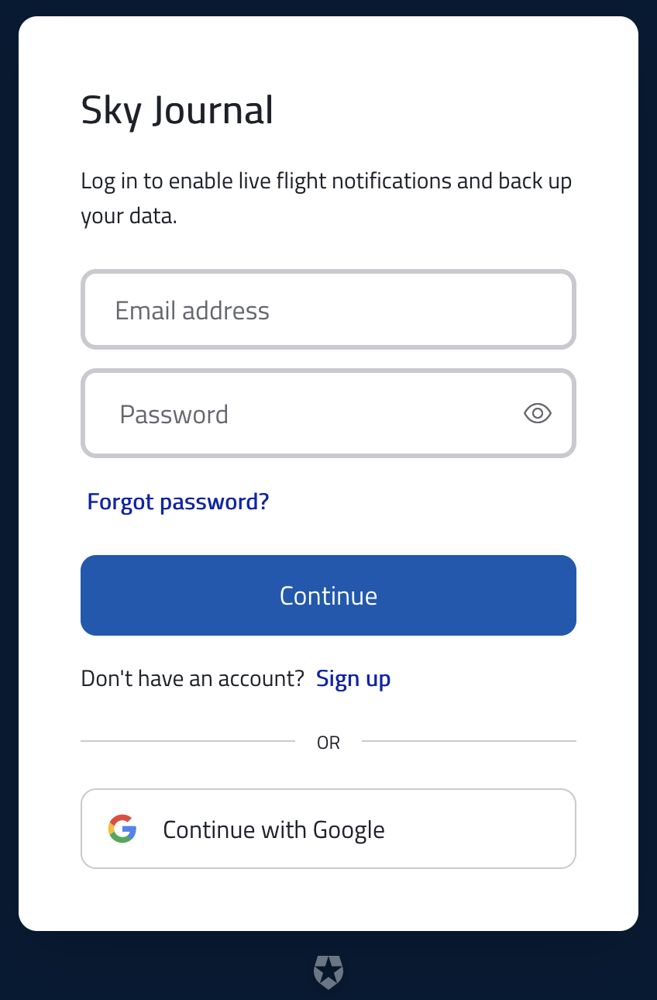

# Sky Journal 1.0.0

## What is this?

A React/Django-based flight logging tool that allows you to track live flights, log past flights, and see flight route statistics—all in one place.

Use it here: https://www.skyjournaltool.com/

## Usage
1.
Search for a flight by its three-letter airline code, flight number,
and IATA departure and arrival codes. 

2a.
If a live flight is found, you'll see its information card. Click the 'plus'
button to add it to your journal. Click the 'refresh' button to update the information
card. The bell icon toggles notifications (to be enabled in a future update).

2b.
If a live flight is not found, you will be prompted to enter its information
manually or start a new search. 

3.
View logged flights in your journal map, as well as cumulative flight statistics.

4.
Sign in or sign up to backup your data. If you don't sign in, your data will
persist across browser refreshes and restarts, but may be erased (and cannot
be accessed on other devices).

## Attributions

JeanExtreme's FlightRadar24 API: https://github.com/JeanExtreme002/FlightRadarAPI 
Mapbox GL: https://docs.mapbox.com/mapbox-gl-js/api/

## Planned updates

- Flight notifications
- Historical flight lookup
